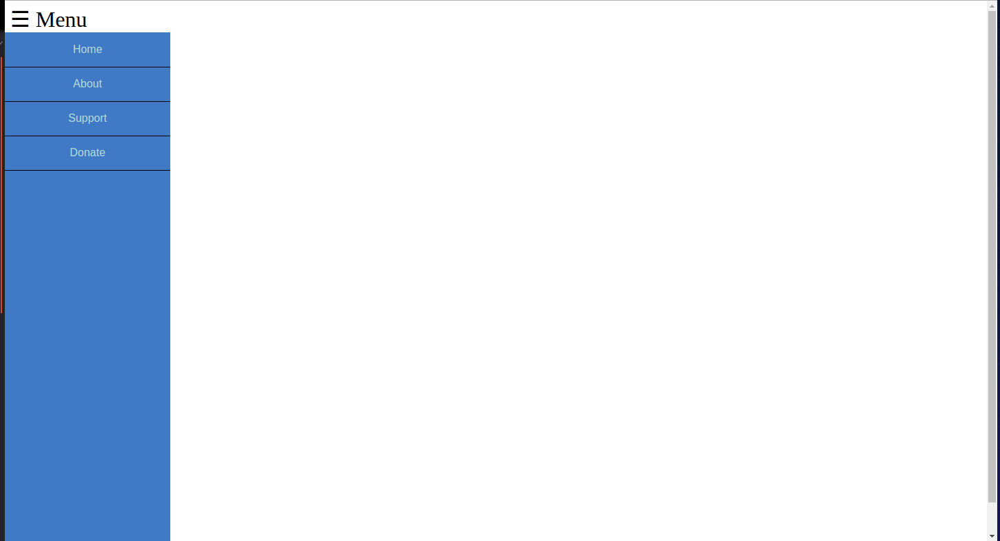
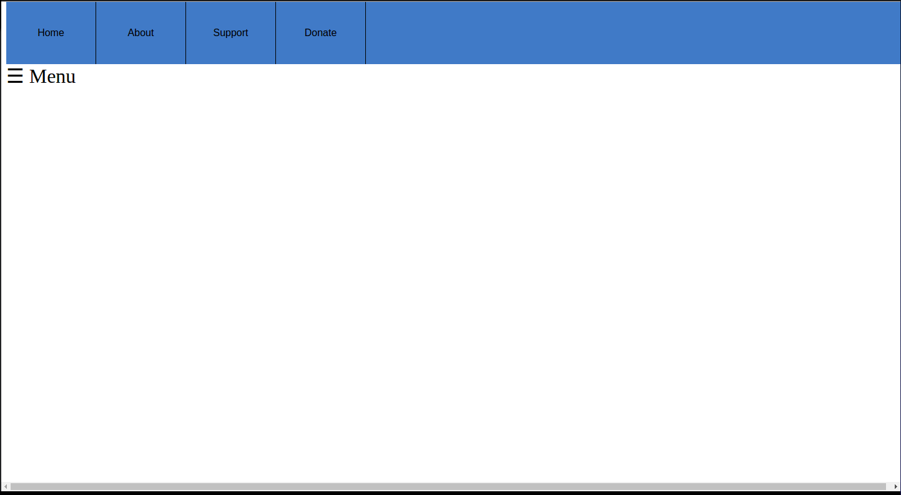
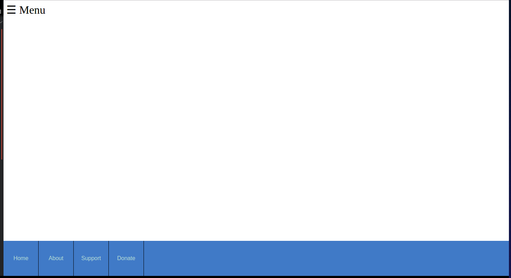

<h1>navNslide</h1>

 is a jQuery snippet used to enabling slide-out navigation with ease. Whether you
want a vertical or horizonal slide-out functionality, navNslide.js will handle it for you.

<h2>Requirements</h2>

navNslide.js requires jQuery(1.7.1+).

<h2>Examples</h2>

<h3>Default slide</h3>

<code>
	<label for="openNav" class="slidebtn">&#9776; Menu</label>
	<input type="checkbox" id="openNav">
			
			<nav class="slider">
				<ul>
					<li><a href="#">Home</a></li>
					<li><a href="#">About</a></li>
					<li><a href="#">Support</a></li>
					<li><a href="#">Donate</a></li>
				</ul>
			</nav>
</code>

 

<h3>Top slider</h3>

<code>
	<label for="openNav" class="slidebtn-top">&#9776; Menu</label>
	<input type="checkbox" id="openNav">
			
			<nav class="slider">
				<ul>
					<li><a href="#">Home</a></li>
					<li><a href="#">About</a></li>
					<li><a href="#">Support</a></li>
					<li><a href="#">Donate</a></li>
				</ul>
			</nav>
</code>

 

<h3>Bottom slider</h3>

<code>
	<label for="openNav" class="slidebtn-btm">&#9776; Menu</label>
	<input type="checkbox" id="openNav">
			
			<nav class="slider">
				<ul>
					<li><a href="#">Home</a></li>
					<li><a href="#">About</a></li>
					<li><a href="#">Support</a></li>
					<li><a href="#">Donate</a></li>
				</ul>
			</nav>
</code>

